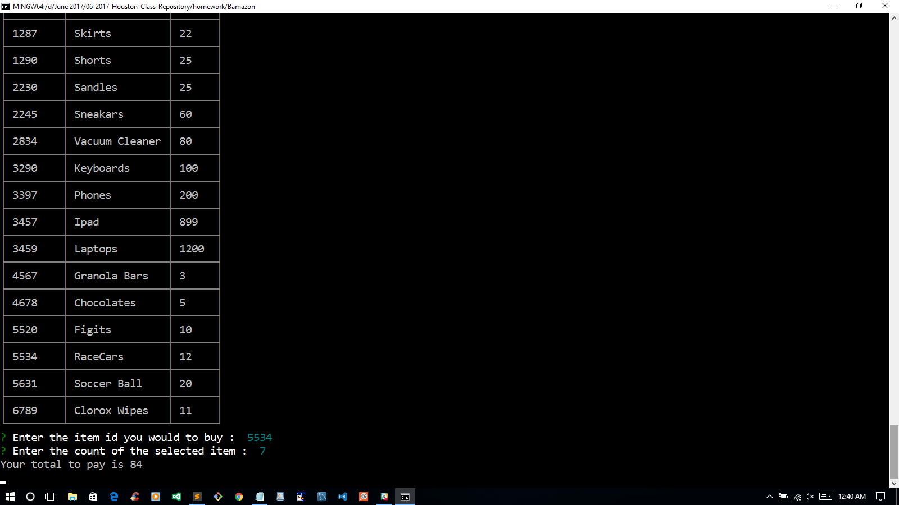
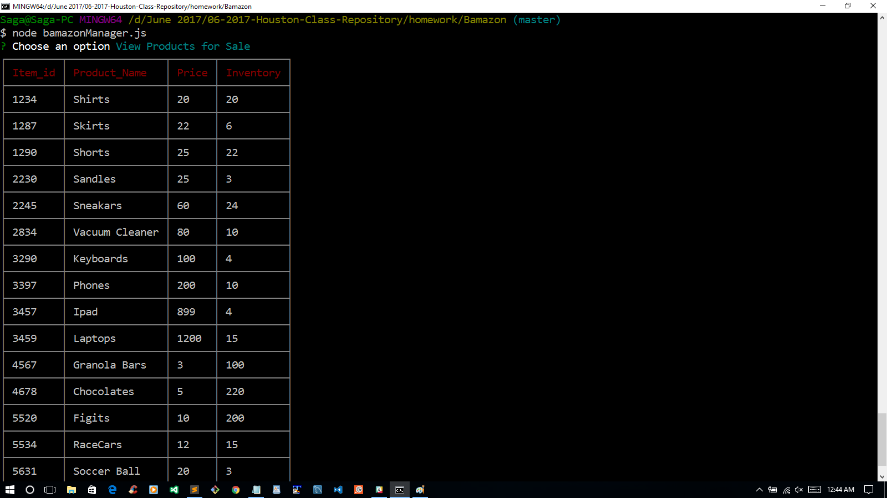
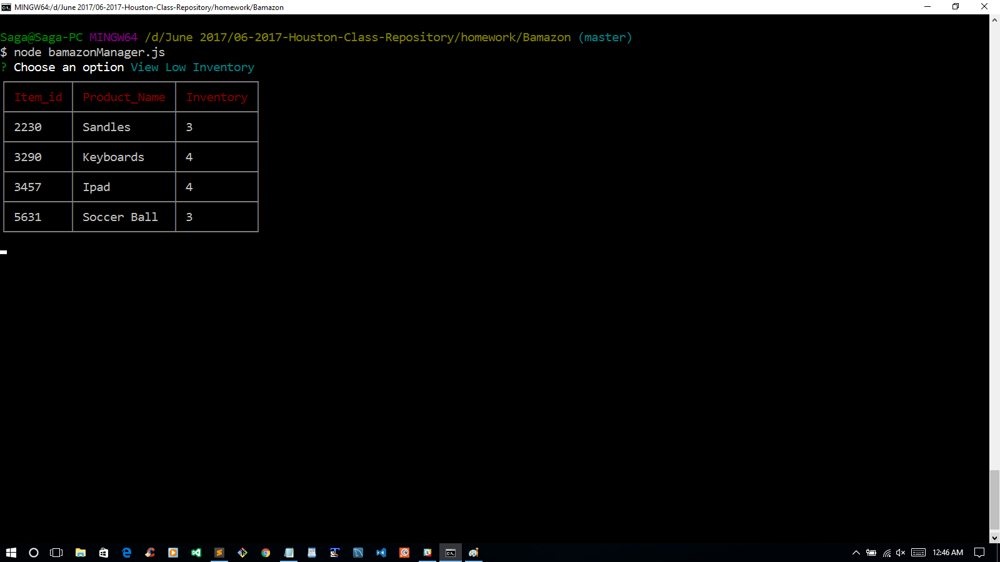
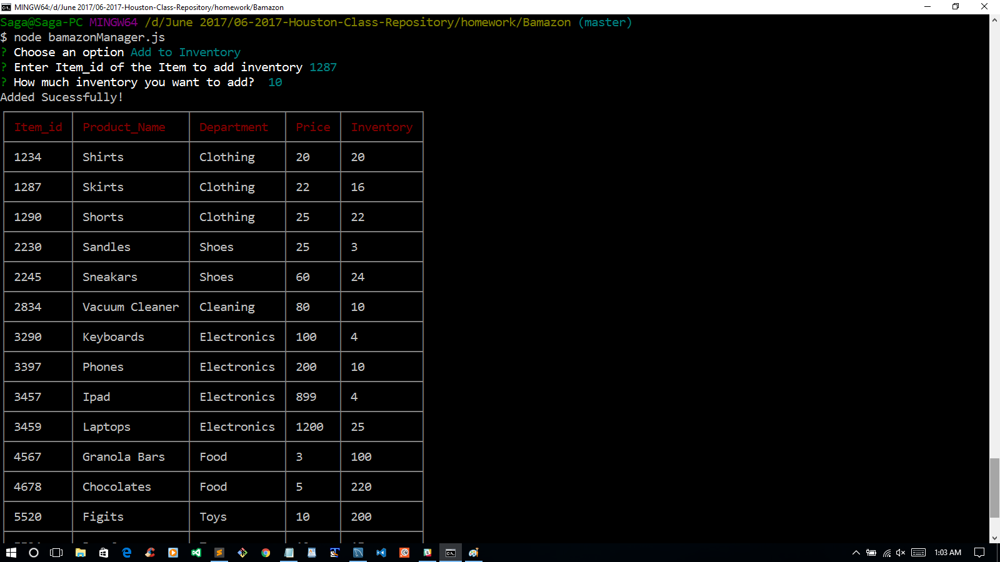
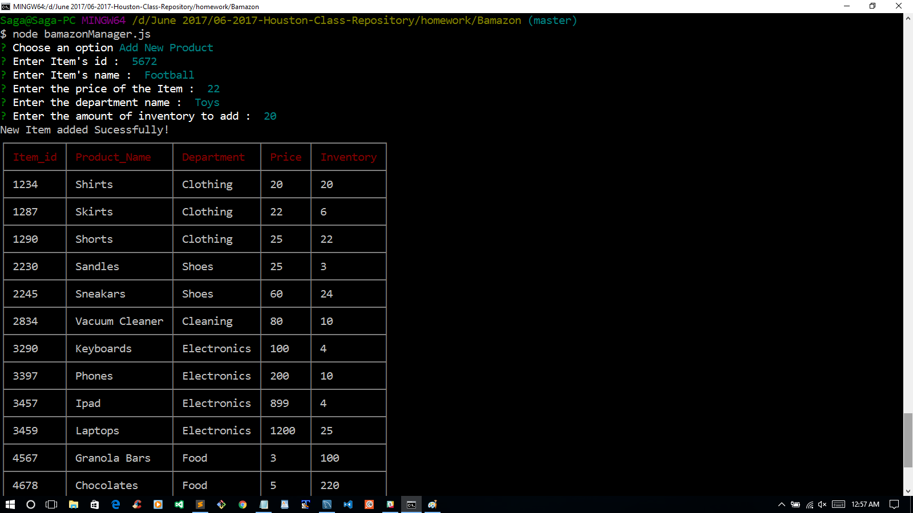

## Bamazon

### Overview
This application is to display the products available on sale. It takes a database named Bamazon, a table named products.

### Process
The customer app display all items on sale coresponding price. 

The Manager app has a few options to choose

View Products for Sale

  
View Low Inventory

Add to Inventory

Add New Product

